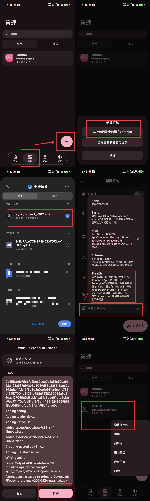

# 无 Root 安装教程

Neural Coherence Tool 已验证可以通过 NPatch 在无 Root 设备上运行。

NPatch 会将 libxposed 加载器和模块配置注入「同调计划」宿主 APK，因此不需要 Root、Magisk
或系统级 LSPosed 环境。

> [!WARNING]
> 使用 NPatch 重新打包后，「同调计划」的 APK 签名将与官方版本不同。
>
> - 无法直接覆盖安装官方版本，必须先卸载原版「同调计划」。
> - 卸载应用会清除本地数据，请提前确认账号和登录方式。
> - 微信、QQ 等第三方登录可能因签名校验而无法使用，建议使用手机号登录。
> - 「同调计划」更新后，需要重新下载新版 APK 并按照本教程打包。
> - **必须使用本教程提供的 NPatch 测试版（已验证 `v1.0.6-724`）。**仅支持
>   libxposed API 101 的稳定版无法加载本模块；其他免 Root 框架不保证兼容。
>
> 如果按照教程操作后仍遇到模块加载、扫描、互动或通知问题，可以前往
> [Issues](https://github.com/YuapXc/Neural-Coherence-Tool/issues) 反馈。

## 一、下载所需文件

开始前需要下载以下三个 APK。

### 1. 同调计划

从官方网站下载最新版「同调计划」：

- [同调计划官方下载](https://tongdiaojihua.lanzout.com/syncproject)

本文撰写时的最新版文件名为：

```text
sync_project_v202.apk
```

文件名可能随官方更新发生变化，请以下载页面提供的最新版为准。

### 2. NPatch

NPatch 是支持 Legacy、libxposed API 101 和 API 102 的无 Root Xposed 注入工具。

- 开源项目：[7723mod/NPatch](https://github.com/7723mod/NPatch/)
- 最新测试版发布消息：[Telegram](https://t.me/onpatch/206)
- 测试版备用下载（`NPatch-v1.0.6-724-release.apk`）：[蓝奏云](https://wwaoz.lanzoum.com/iJaw73y64v7g)
- 蓝奏云密码：`e1oy`

> [!IMPORTANT]
> Neural Coherence Tool 使用 **libxposed API 102**。
>
> 请使用上方链接提供的 NPatch 测试版（已验证 `v1.0.6-724`），或明确标注支持
> libxposed API 102 的后续测试版。**不要使用仅支持 API 101 的 NPatch 稳定版**，
> 否则模块不会被加载。

### 3. Neural Coherence Tool

- 开源项目：[YuapXc/Neural-Coherence-Tool](https://github.com/YuapXc/Neural-Coherence-Tool)
- APK 下载：[GitHub Releases](https://github.com/YuapXc/Neural-Coherence-Tool/releases)

下载 Release 页面中最新版本的模块 APK。

## 二、卸载官方版同调计划

由于重新打包后的 APK 签名与官方版不同，Android 不允许直接覆盖安装。

1. 确认自己可以通过手机号或其他可用方式重新登录。
2. 卸载设备上原有的官方版「同调计划」。
3. 暂时不要重新安装官方 APK，下一步将在 NPatch 中完成打包和安装。

> [!CAUTION]
> 卸载应用会清除其本地数据。请确认账号信息后再继续操作。

## 三、安装 NPatch 和模块

先安装以下两个 APK：

1. NPatch
2. Neural Coherence Tool

此时不要直接安装刚刚下载的官方「同调计划」APK。

如果系统询问是否允许 NPatch 安装未知来源应用，请根据系统提示授予相应权限。

## 四、使用 NPatch 重新打包同调计划

1. 打开 NPatch。
2. 进入底部的「管理」页面。
3. 点击右下角的加号。
4. 选择「新建打包」。
5. 选择「从存储目录中选择（多个）APK」。
6. 在文件选择器中选中下载好的「同调计划」官方 APK，例如：

   ```text
   sync_project_v202.apk
   ```

7. 进入「新建打包」页面后，选择「本地模式」。
8. 找到页面底部的「破解签名校验」。
9. 将签名校验破解等级选择为 **Stealth**。
10. 点击「开始打包」。
11. 等待 NPatch 显示打包完成，然后点击「安装」。

> [!IMPORTANT]
> 当前测试中，只有 **Stealth** 可以使重新打包后的「同调计划」正常启动并运行模块。
>
> `None`、`Basic`、`High` 和 `Extreme` 均不作为本教程的推荐配置。



## 五、启用模块作用域

完成打包和安装后：

1. 返回 NPatch 的「管理」页面。
2. 点击已经安装的「同调计划」。
3. 选择「模块作用域」。
4. 勾选 **Neural Coherence Tool**。
5. 返回上一页。
6. 强制停止并重新打开「同调计划」；必要时也可以在 NPatch 中执行一次「强制重启」。

如果没有启用模块作用域，「同调计划」仍然可以启动，但不会显示模块面板。

## 六、登录同调计划

打开重新打包后的「同调计划」。

由于 APK 签名已经改变，微信、QQ 等第三方登录方式可能提示签名不匹配、应用未授权或登录失败。

建议使用：

- 手机号登录
- 其他不依赖 APK 官方签名的登录方式

登录成功后，正常进入应用主页。

## 七、使用扫描和一键互动

1. 打开底部的「同调网络」页面。
2. 页面标题区域会显示 Neural Coherence Tool 控制面板。
3. 点击「扫描」，可以只读取并统计当前好友互动状态。
4. 点击「互动」，确认后即可按照好友状态顺序执行一键互动：
   - 无色状态发送 `ping`
   - 绿色状态发送 `pong`
   - 当日已经完成互动的好友会自动跳过
5. 等待应用内弹窗或系统通知显示完成结果。

首次使用通知功能时，请允许 Neural Coherence Tool 发送通知。部分系统还需要允许模块自启动和
后台运行。

## 常见问题

### 打包后的同调计划无法安装

请确认已经卸载官方版本。官方 APK 与 NPatch 打包后的 APK 签名不同，二者不能互相覆盖安装。

### 打包后的同调计划打开后闪退

请检查：

1. 是否使用支持 libxposed API 102 的 NPatch 最新测试版。
2. 「破解签名校验」是否选择了 `Stealth`。
3. 是否使用从官方渠道下载的最新版「同调计划」APK。
4. 是否误用了已经被其他工具修改过的宿主 APK。

### 同调计划可以打开，但没有模块面板

请检查：

1. Neural Coherence Tool 是否已经单独安装。
2. 是否在 NPatch 的「模块作用域」中勾选 Neural Coherence Tool。
3. 是否强制停止并重新打开了「同调计划」。
4. 当前页面是否为「同调网络」主页。

### 微信或 QQ 无法登录

这是重新签名宿主 APK 后可能出现的限制。微信、QQ 等平台可能校验应用包名与官方签名的组合，
建议改用手机号登录。

### 更新同调计划后模块失效

官方应用更新后，需要：

1. 下载新的官方 APK。
2. 使用 NPatch 和 `Stealth` 重新打包。
3. 安装新生成的 APK。
4. 重新确认模块作用域。

宿主更新还可能改变 Flutter 页面或接口结构。如果重新打包后模块仍不能正常工作，请提交 Issue。

## 问题反馈

反馈问题时建议提供：

- 手机型号和 Android 版本
- NPatch 版本
- 同调计划版本
- Neural Coherence Tool 版本
- 使用的打包模式和签名校验等级
- 问题截图
- NPatch 日志中的相关错误

NPatch 日志通常位于：

```text
/storage/emulated/0/Android/media/com.linktech.arkradar/npatch/log/
```

提交日志前，请先检查并隐藏账号、设备信息或其他隐私内容：

- [提交 Issue](https://github.com/YuapXc/Neural-Coherence-Tool/issues)
